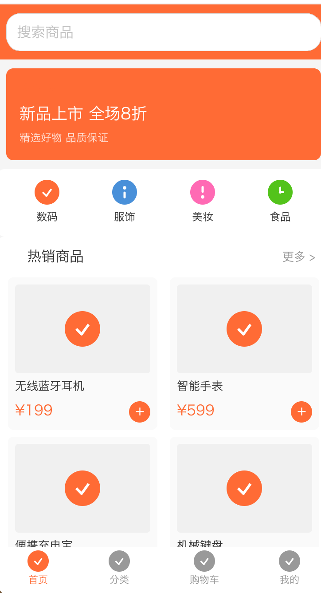

# Mini Render

一个用 Rust 实现的轻量级微信小程序渲染引擎，支持 WXML/WXSS 解析、Flexbox 布局、组件渲染和 JavaScript 运行时。

## ✨ 特性

- 🎨 **2D 渲染引擎** - 纯 Rust 实现，支持抗锯齿、Alpha 混合
- ⚡ **QuickJS 脚本引擎** - 完整的 JavaScript 运行时
- 🧩 **丰富的组件** - 支持 26+ 微信小程序组件
- 📐 **Flexbox 布局** - 基于 Taffy 的完整 Flexbox 支持
- 🖼️ **Canvas 2D** - 完整的 Canvas 2D 绑图 API
- 📄 **WXML/WXSS 解析** - 支持模板语法和 rpx 单位
- 🎯 **完整 CSS 支持** - 组件支持标准 CSS 样式
- 🔗 **C FFI 接口** - 可嵌入其他语言

## 📸 运行效果



## 🏗️ 架构

```
┌─────────────────────────────────────────────────┐
│                  Mini App                        │
│  ┌──────────────────────────────────────────┐   │
│  │              JavaScript (QuickJS)         │   │
│  │  ┌─────────┐  ┌─────────┐  ┌──────────┐  │   │
│  │  │   App   │  │  Page   │  │Component │  │   │
│  │  └─────────┘  └─────────┘  └──────────┘  │   │
│  └──────────────────────────────────────────┘   │
│                      ↕ Bridge                    │
│  ┌──────────────────────────────────────────┐   │
│  │              Native (Rust)                │   │
│  │  ┌─────────┐  ┌─────────┐  ┌──────────┐  │   │
│  │  │ Canvas  │  │  Taffy  │  │  Event   │  │   │
│  │  │ Render  │  │ Layout  │  │  System  │  │   │
│  │  └─────────┘  └─────────┘  └──────────┘  │   │
│  │  ┌─────────┐  ┌─────────┐  ┌──────────┐  │   │
│  │  │  WXML   │  │  WXSS   │  │ Template │  │   │
│  │  │ Parser  │  │ Parser  │  │  Engine  │  │   │
│  │  └─────────┘  └─────────┘  └──────────┘  │   │
│  └──────────────────────────────────────────┘   │
│                      ↕ FFI                       │
│  ┌──────────────────────────────────────────┐   │
│  │           Host Application                │   │
│  │      (iOS / Android / Desktop / Web)      │   │
│  └──────────────────────────────────────────┘   │
└─────────────────────────────────────────────────┘
```

## 🧩 支持的组件

### 基础组件
| 组件 | 说明 | CSS 支持 |
|------|------|----------|
| `view` | 视图容器 | ✅ 完整 |
| `text` | 文本 | ✅ 完整 |
| `image` | 图片 | ✅ 完整 |
| `icon` | 图标 | ✅ 完整 |
| `rich-text` | 富文本 | ✅ 基础 |

### 表单组件
| 组件 | 说明 | CSS 支持 |
|------|------|----------|
| `button` | 按钮 | ✅ 完整 |
| `input` | 输入框 | ✅ 完整 |
| `textarea` | 多行输入 | ✅ 完整 |
| `checkbox` | 复选框 | ✅ 完整 |
| `checkbox-group` | 复选框组 | ✅ 基础 |
| `radio` | 单选框 | ✅ 完整 |
| `radio-group` | 单选框组 | ✅ 基础 |
| `switch` | 开关 | ✅ 完整 |
| `slider` | 滑动选择器 | ✅ 完整 |
| `progress` | 进度条 | ✅ 完整 |
| `picker` | 选择器 | ✅ 基础 |
| `picker-view` | 嵌入式选择器 | ✅ 基础 |

### 容器组件
| 组件 | 说明 | CSS 支持 |
|------|------|----------|
| `scroll-view` | 滚动视图 | ✅ 完整 |
| `swiper` | 轮播图 | ✅ 基础 |
| `swiper-item` | 轮播项 | ✅ 基础 |

### 媒体组件
| 组件 | 说明 | CSS 支持 |
|------|------|----------|
| `video` | 视频 | ✅ 基础 |
| `canvas` | 画布 | ✅ 完整 |

## 🎨 CSS 样式支持

所有组件支持以下 CSS 属性：

### 布局
- `display`: flex, block, none, grid
- `flex-direction`, `flex-wrap`, `flex-grow`, `flex-shrink`
- `justify-content`, `align-items`, `align-self`, `align-content`
- `width`, `height`, `min-width`, `max-width`, `min-height`, `max-height`
- `padding`, `margin` (支持四个方向独立设置)
- `position`: relative, absolute, fixed
- `top`, `right`, `bottom`, `left`
- `gap`, `row-gap`, `column-gap`

### 外观
- `background-color`, `color`
- `border`, `border-width`, `border-color`
- `border-radius` (支持四角独立设置)
- `box-shadow`
- `opacity`
- `overflow`: visible, hidden, scroll, auto

### 文本
- `font-size`, `font-weight`
- `text-align`: left, center, right, justify
- `text-decoration`: none, underline, line-through
- `line-height`, `letter-spacing`
- `white-space`: normal, nowrap, pre, pre-wrap
- `text-overflow`: clip, ellipsis
- `vertical-align`: baseline, top, middle, bottom
- `word-break`: normal, break-all, keep-all

### 变换
- `transform`: translate, scale, rotate, skew
- `z-index`

## 📄 WXML 模板语法

```html
<!-- 数据绑定 -->
<view>{{message}}</view>

<!-- 列表渲染 -->
<view wx:for="{{items}}" wx:key="id">
  <text>{{item.name}}</text>
</view>

<!-- 条件渲染 -->
<view wx:if="{{condition}}">显示</view>
<view wx:elif="{{other}}">其他</view>
<view wx:else>默认</view>

<!-- 事件绑定 -->
<button bindtap="handleTap" data-id="{{id}}">点击</button>
```

## 📐 WXSS 样式

```css
/* 支持 rpx 单位 */
.container {
  width: 750rpx;
  padding: 20rpx;
}

/* 支持 Flexbox */
.flex-row {
  display: flex;
  flex-direction: row;
  justify-content: space-between;
}

/* 支持圆角和阴影 */
.card {
  border-radius: 16rpx;
  box-shadow: 0 4rpx 12rpx rgba(0,0,0,0.1);
}
```

## ⚡ JavaScript API

### 应用生命周期
```javascript
App({
  onLaunch() { },
  onShow() { },
  globalData: { }
})
```

### 页面生命周期
```javascript
Page({
  data: { message: 'Hello' },
  onLoad(options) { },
  onShow() { },
  onReady() { },
  setData(data) { }
})
```

### 微信 API
```javascript
// 数据存储
wx.setStorageSync('key', 'value')
wx.getStorageSync('key')

// UI 反馈
wx.showToast({ title: '成功' })
wx.showModal({ title: '提示', content: '确认?' })
wx.showLoading({ title: '加载中' })

// 页面导航
wx.navigateTo({ url: '/pages/detail/detail' })
wx.navigateBack()
wx.switchTab({ url: '/pages/index/index' })

// 系统信息
wx.getSystemInfoSync()

// Canvas 绑图
const ctx = wx.createCanvasContext('myCanvas')
ctx.setFillStyle('#FF0000')
ctx.fillRect(10, 10, 100, 50)
ctx.draw()

// 定时器
setTimeout(() => {}, 1000)
setInterval(() => {}, 1000)
```

### Canvas 2D API

```javascript
// 创建 Canvas 上下文
const ctx = wx.createCanvasContext('canvasId')

// 样式设置
ctx.setFillStyle('#FF0000')      // 填充颜色
ctx.setStrokeStyle('#00FF00')    // 描边颜色
ctx.setLineWidth(2)              // 线宽
ctx.setGlobalAlpha(0.5)          // 全局透明度

// 矩形绑制
ctx.fillRect(x, y, width, height)    // 填充矩形
ctx.strokeRect(x, y, width, height)  // 描边矩形
ctx.clearRect(x, y, width, height)   // 清除矩形区域

// 路径绑制
ctx.beginPath()                      // 开始路径
ctx.moveTo(x, y)                     // 移动到点
ctx.lineTo(x, y)                     // 画线到点
ctx.arc(x, y, r, startAngle, endAngle, counterclockwise)  // 圆弧
ctx.closePath()                      // 闭合路径
ctx.fill()                           // 填充路径
ctx.stroke()                         // 描边路径

// 状态管理
ctx.save()                           // 保存状态
ctx.restore()                        // 恢复状态
ctx.translate(x, y)                  // 平移

// 提交绘制
ctx.draw()                           // 绑制到 canvas
```

## 🚀 快速开始

### 安装依赖

```bash
# 安装 Rust
curl --proto '=https' --tlsv1.2 -sSf https://sh.rustup.rs | sh

# 克隆项目
git clone <repo-url>
cd mini-render

# 构建
cargo build --release
```

### 运行示例

```bash
# 运行小程序启动器（推荐 - 可加载 sample 目录下的小程序）
cargo run --release --bin mini-launcher

# 运行内置示例小程序
cargo run --release --bin mini-app-window

# 运行渲染示例
cargo run --example demo
```

### 小程序启动器

`mini-launcher` 是一个小程序启动器，可以扫描 `sample` 目录下的所有小程序并加载运行：

1. 在 `sample` 目录下创建小程序项目（使用微信开发者工具创建）
2. 运行 `cargo run --bin mini-launcher`
3. 在列表中点击"启动"按钮加载小程序
4. 点击左上角返回按钮回到列表

## 📁 项目结构

```
mini-render/
├── src/
│   ├── lib.rs                  # 库入口
│   ├── canvas.rs               # 画布核心（绘图、抗锯齿）
│   ├── color.rs                # 颜色处理
│   ├── geometry.rs             # 几何图形
│   ├── paint.rs                # 画笔样式
│   ├── path.rs                 # 路径绘制
│   ├── text.rs                 # 文本渲染
│   ├── event.rs                # 事件系统
│   ├── ffi.rs                  # C FFI 接口
│   ├── bin/
│   │   ├── main.rs             # CLI 入口
│   │   └── window.rs           # 窗口应用
│   ├── js/                     # JavaScript 引擎
│   │   ├── runtime.rs          # QuickJS 运行时
│   │   ├── api.rs              # 小程序 API 实现
│   │   └── bridge.rs           # JS-Native 桥接
│   ├── parser/                 # 解析器
│   │   ├── wxml.rs             # WXML 解析器
│   │   ├── wxss.rs             # WXSS 解析器
│   │   └── template.rs         # 模板引擎
│   ├── renderer/               # 渲染器
│   │   ├── wxml_renderer.rs    # WXML 渲染器
│   │   └── components/         # 组件实现
│   │       ├── base.rs         # 基础样式解析
│   │       ├── view.rs         # View 组件
│   │       ├── text.rs         # Text 组件
│   │       ├── button.rs       # Button 组件
│   │       ├── image.rs        # Image 组件
│   │       ├── input.rs        # Input 组件
│   │       ├── checkbox.rs     # Checkbox 组件
│   │       ├── checkbox_group.rs # CheckboxGroup/RadioGroup
│   │       ├── radio.rs        # Radio 组件
│   │       ├── switch.rs       # Switch 组件
│   │       ├── slider.rs       # Slider 组件
│   │       ├── progress.rs     # Progress 组件
│   │       ├── icon.rs         # Icon 组件
│   │       ├── video.rs        # Video 组件
│   │       ├── canvas.rs       # Canvas 组件
│   │       ├── swiper.rs       # Swiper 组件
│   │       ├── rich_text.rs    # RichText 组件
│   │       └── picker.rs       # Picker 组件
│   ├── layout/                 # 布局系统
│   ├── ui/                     # UI 工具
│   │   ├── scroll_controller.rs # 滚动控制
│   │   └── scroll_cache.rs     # 滚动缓存优化
│   └── runtime/                # 应用运行时
├── assets/                     # 字体资源
│   └── NotoSansSC-Regular.ttf
├── include/
│   └── mini_render.h           # C 头文件
├── examples/                   # 示例代码
│   ├── demo.rs
│   ├── demo.c
│   └── mini_app_window.rs
└── sample-app/                 # 示例小程序
    ├── app.js
    ├── app.json
    ├── custom-tab-bar/         # 自定义 TabBar
    └── pages/
        ├── index/              # 首页
        ├── category/           # 分类页
        ├── cart/               # 购物车
        ├── profile/            # 个人中心
        ├── list/               # 列表页
        ├── detail/             # 详情页
        ├── canvas/             # Canvas 示例页
        └── components/         # 组件示例页
```

## 🔧 C/C++ 集成

```c
#include "mini_render.h"

// 创建画布
Canvas* canvas = mr_canvas_new(375, 667);
mr_canvas_clear(canvas, 255, 255, 255, 255);

// 绘制图形
mr_canvas_draw_rect(canvas, 10, 10, 100, 50, 0x4A, 0x90, 0xD9, 255, 0, 0);
mr_canvas_draw_circle(canvas, 200, 100, 30, 0xE7, 0x4C, 0x3C, 255, 0, 0);

// 保存为 PNG
mr_canvas_save_png(canvas, "output.png");
mr_canvas_free(canvas);
```

### 编译动态库

```bash
cargo build --release

# macOS: target/release/libmini_render.dylib
# Linux: target/release/libmini_render.so
# Windows: target/release/mini_render.dll
```

## 📋 依赖

- [Taffy](https://github.com/DioxusLabs/taffy) - Flexbox 布局引擎
- [QuickJS](https://bellard.org/quickjs/) - JavaScript 引擎
- [winit](https://github.com/rust-windowing/winit) - 跨平台窗口
- [softbuffer](https://github.com/rust-windowing/softbuffer) - 软件渲染
- [image](https://github.com/image-rs/image) - 图片处理
- [fontdue](https://github.com/mooman219/fontdue) - 字体渲染

## 📄 License

MIT
